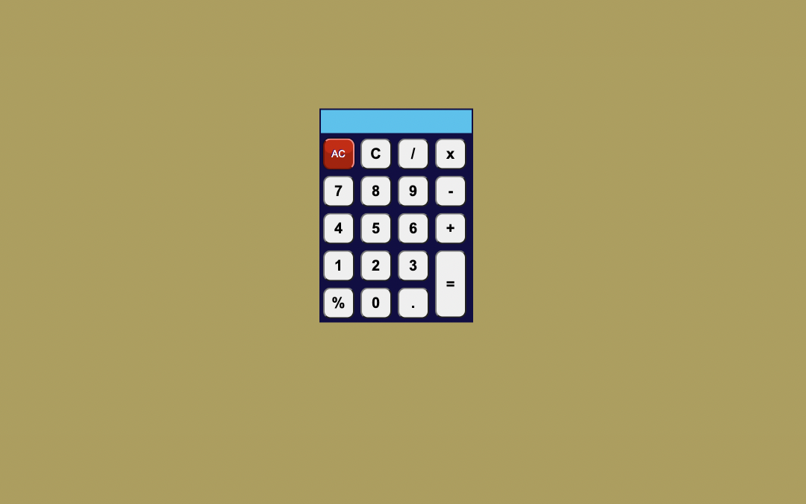

## What to build

we have to build Accordion.

## Input

## Techanology used

we have used HTML, CSS and JavaScript DOM.

## What I have learned from this project

I have learned how to read operator and operends from calculator Ui and perform mathematical operation according operator and operends, and finaly display result on calculator screen.

## Mathematical Operation In Calculator

## Output

### Instructor

**Hitesh choudhary**
